<div align="center">


<h1 align="center">👕 FitFusion</h1>

<h3 align="center">
AI-Powered Virtual Try-On & Intelligent Outfit Recommendation System
</h3>

<p align="center">
Graduation Project <br>
Faculty of Computer and Information Sciences <br>
Ain Shams University
</p>

<p align="center">


</p>

</div>

---

# 🎥 Live Demo

<p align="center">

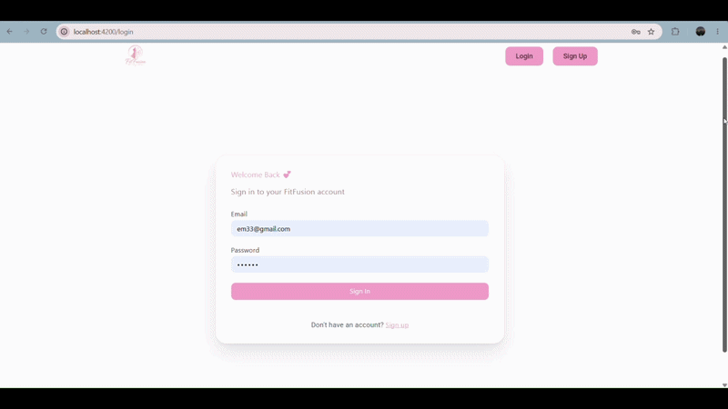

</p>

<div align="center">

### 📹 Full Demo

https://drive.google.com/file/d/1kTmrvGKqpr4r6aVgyLJ_ki6cgIc9NiHn/view?usp=sharing

### 📑 Presentation

https://canva.link/ubffcdzs23q8u0o

</div>

---

# 📖 Overview

FitFusion is an AI-powered fashion assistant that combines **Virtual Try-On**, **Digital Closet Management**, and **Intelligent Outfit Recommendation** into a single intelligent platform.

The system enables users to:

- 👕 Organize a digital closet
- 🤖 Receive AI-generated outfit recommendations
- 👗 Virtually try clothes before purchasing
- 🎨 Match clothing based on color harmony, season, occasion, and compatibility

Our goal is to reduce uncertainty in online fashion shopping while helping users create stylish outfits effortlessly.

---

# ✨ Features

## 👕 Virtual Try-On

- Upload a person image
- Upload a clothing image
- Generate realistic try-on results

---

## 👚 Smart Digital Closet

- Store clothes permanently (closet)
- uploads for one-time recommendations
- Automatic clothing classification

---

## 🎯 Outfit Recommendation

Generate complete outfits consisting of:

- 👕 Top
- 👖 Bottom
- 👟 Shoes

Recommendations are based on:

- Occasion
- Season
- Color Harmony
- Gender
- Clothing Compatibility
- Existing Wardrobe

---

## 🤖 Clothing Classification

Automatically predicts:

- Category
- Type
- Color
- Season
- Gender
- Usage

---

## 🔐 Authentication

- User Registration
- Login
- Authentication
- Personalized Closet

---

# 📸 Application Preview

<table>
<tr>
<td align="center"> ### Login 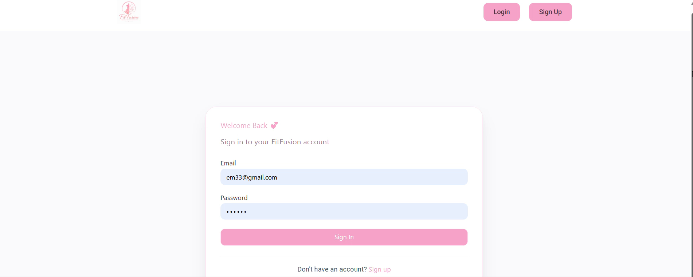 </td>

<td align="center"> ### Home 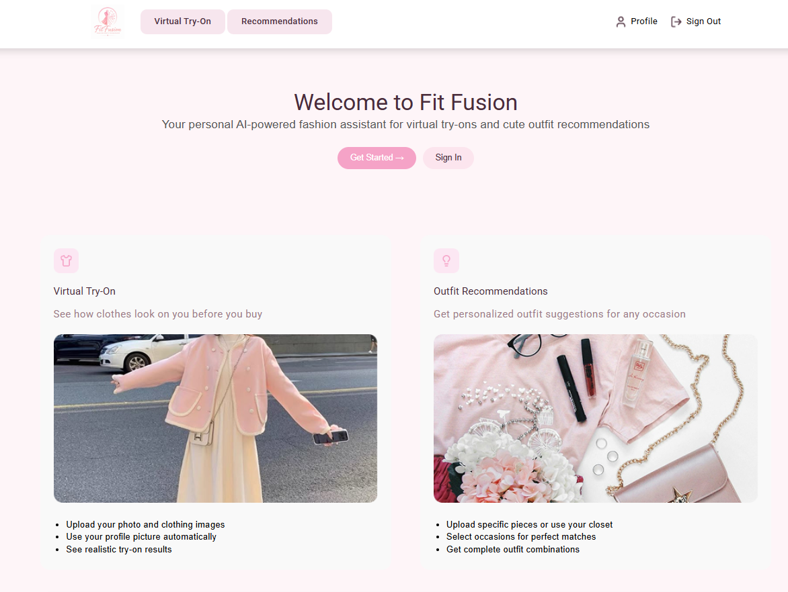 </td>
</tr>

<tr>
<td align="center"> ### Profile 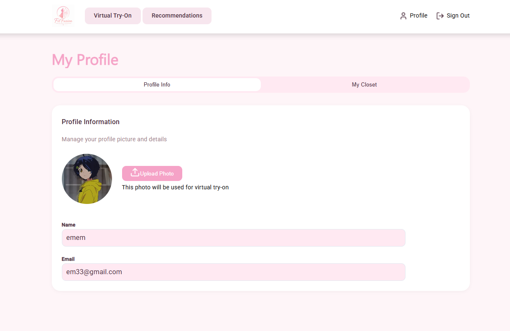 </td>

<td align="center"> ### Closet 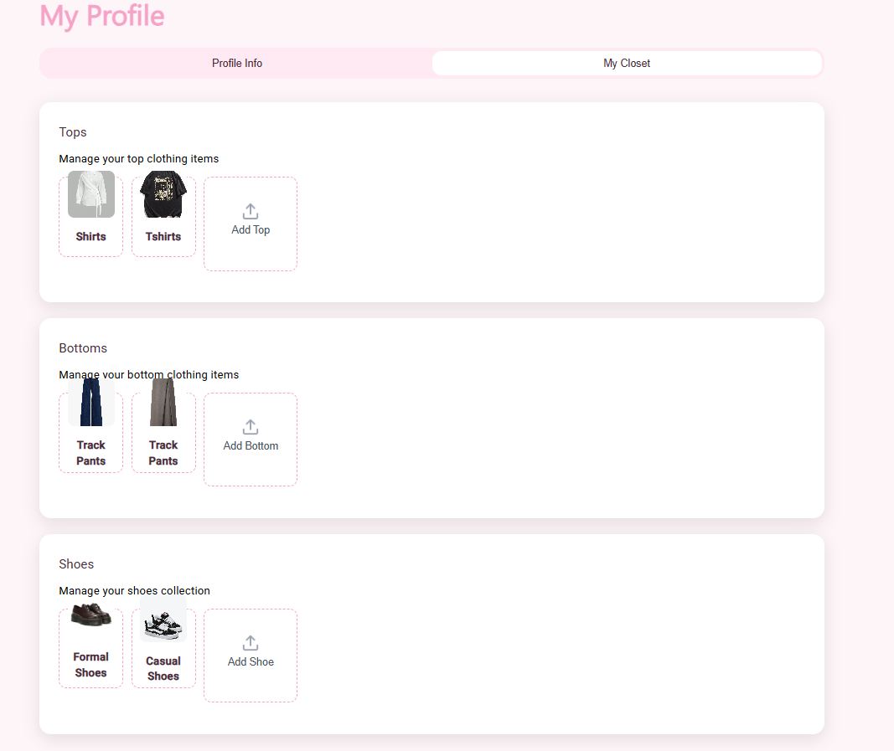 </td>
</tr>

<tr>
<td colspan="2" align="center">

### Recommendation Page

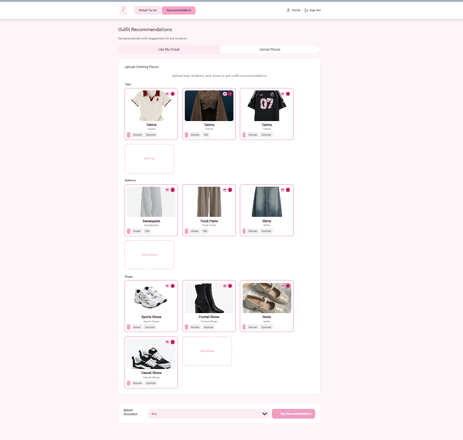

</td>
</tr>
</table>

---

# 👗 Outfit Recommendation Examples

<table>
<tr>

<td align="center">

### Casual

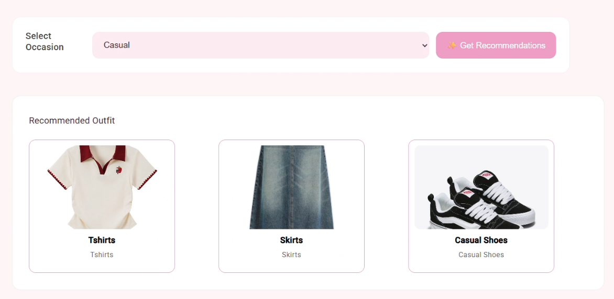

</td>

<td align="center">

### Formal

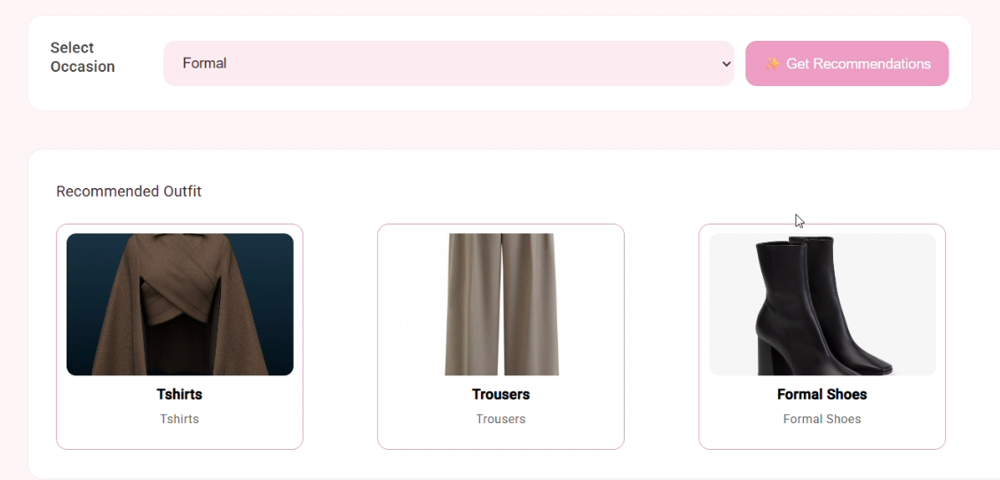

</td>

<td align="center">

### Sports

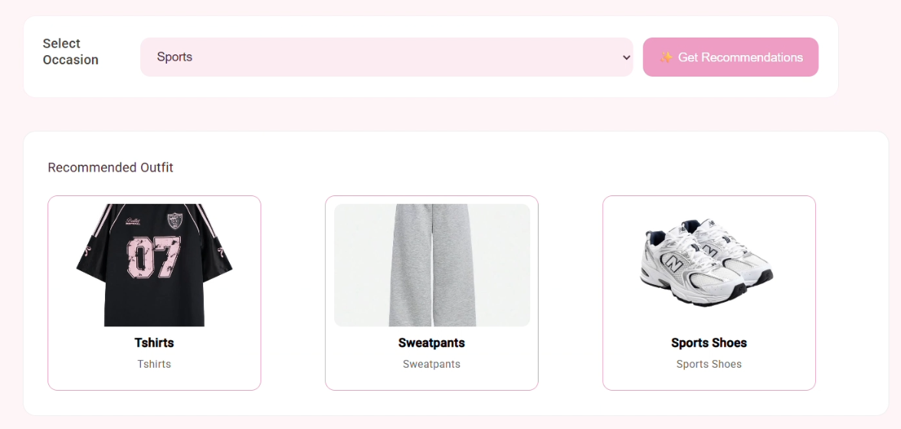

</td>

</tr>
</table>

---

# 👕 Virtual Try-On Results

<table>

<tr>

<td align="center">

### Top

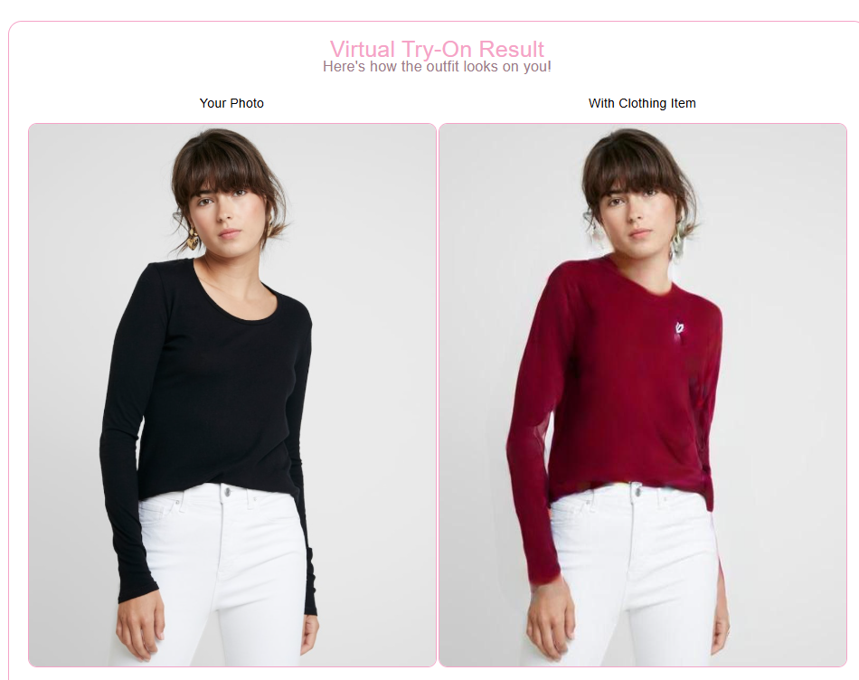

</td>

<td align="center">

### Bottom

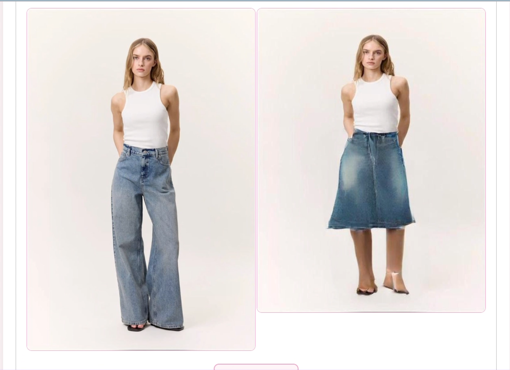

</td>

<td align="center">

### Dress

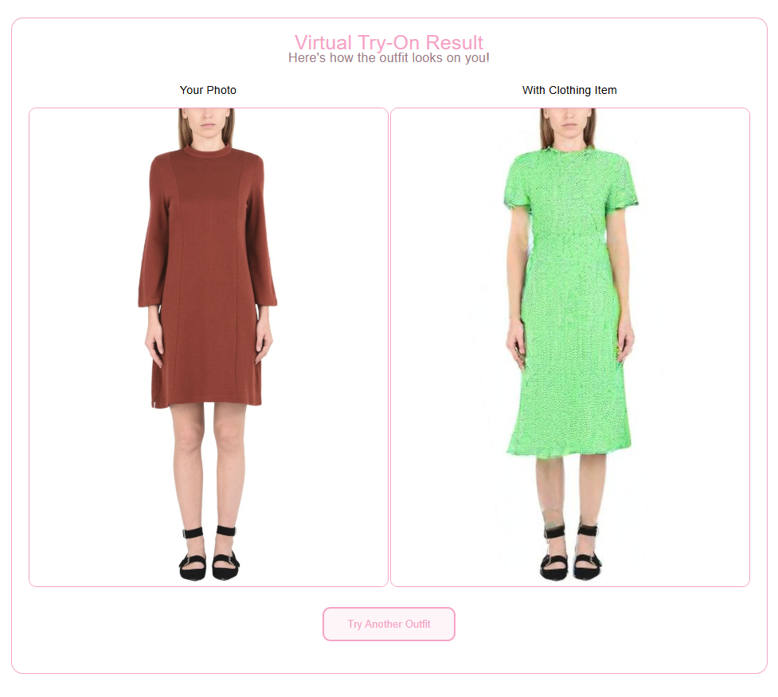

</td>

<td align="center">

### Bag

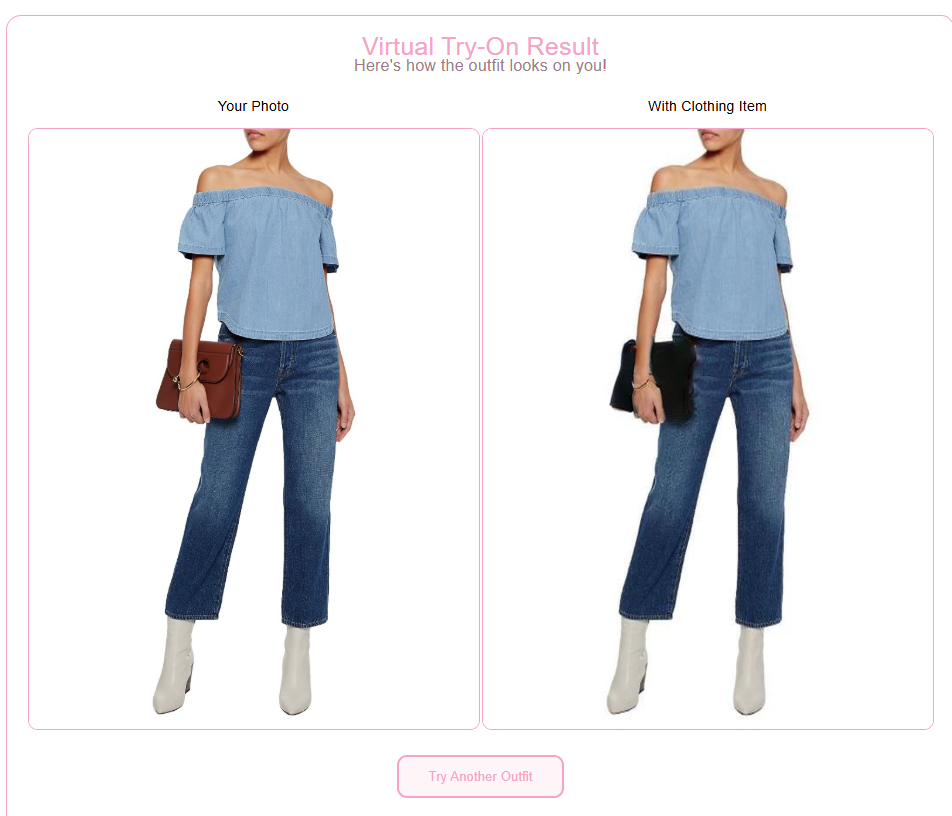

</td>

</tr>

</table>

---

# 🏗️ System Architecture

<p align="center">

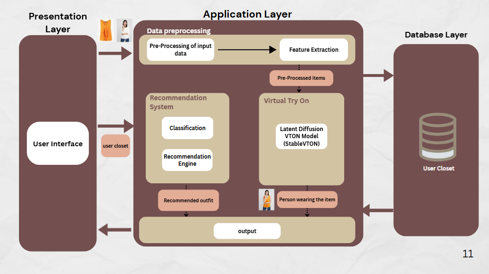

</p>

---

# 📄 Project Poster

<p align="center">


</p>

--- 

-# 🔄 System Workflow

```text
                    User Login
                         │
                         ▼
                   Home Dashboard
                         │
          ┌──────────────┴──────────────┐
          │                             │
          ▼                             ▼
  Outfit Recommendation         Virtual Try-On
          │                             │
          │                             │
 ┌────────┴────────┐            Upload Person Image
 │                 │                  │
 ▼                 ▼                  ▼
Use Closet     Upload Clothes    Upload Garment Image
Items          (Temporary)              │
 │                 │                    ▼
 └────────┬────────┘          Generate Try-On Result
          │
          ▼
Clothing Classification
          │
          ▼
Recommendation Engine
          │
          ▼
Recommended Outfit
```

---

# 🚀 Technology Stack

## Frontend

- Angular
- TypeScript
- HTML5
- CSS3

---

## Backend

- FastAPI
- Python

---

## AI / Machine Learning

- TensorFlow
- PyTorch
- OpenCV
- ResNet50
- Detectron2
- OpenPose

---

## Database

- MongoDB *(Replace if different)*

---

# 📂 Project Structure

```text
FitFusion/
│
├── backend/
│   ├── api/                 # REST API endpoints
│   ├── recommendation/       # Outfit recommendation engine
│   ├── virtual_try_on/       # Virtual try-on pipeline
│   ├── classification/       # Clothing classification models
│   ├── database/             # Database operations
│   ├── utils/
│   ├── requirements.txt
│   └── main.py
│
├── frontend/
│   ├── src/
│   ├── public/
│   ├── package.json
│   └── angular.json
│
├── screenshots/
│   ├── logo.png
│   ├── demo.gif
│   └── *.png
│
├── README.md
├── LICENSE
└── .gitignore
```

---

# ⚙️ Installation

Clone the repository

```bash
git clone https://github.com/Emannsaleh/FitFusion_12.git

cd FitFusion_12
```

Install backend dependencies

```bash
cd backend

pip install -r requirements.txt
```

Run the backend

```bash
uvicorn App.main:app --reload
```

Run the frontend

```bash
cd frontend

npm install

ng serve
```

---

# 📊 Performance

## Virtual Try-On

| Model | Parameters | SSIM |
|---------|-----------:|-----:|
| LaDI-VTON | 865M | 0.881 |
| ITA-MDT | 671M | 0.885 |
| **ITA-MDT-S (Ours)** | **49M** | **0.853** |

---

## Classification

| Task | Accuracy |
|--------|---------:|
| Category Classification | ~99% |
| Clothing Attributes | ~80% |

---

# 📚 Datasets

- VITON-HD
- DressCode
- Custom Bags Dataset
- Pretrained Dataset (used for training claasification models)
- Dynamic Dataset (built during run-time)

---

# 🌟 Future Improvements

- Mobile Application
- Real-Time Camera Try-On
- Accessory Recommendation
- Personalized Fashion Style Learning
- More Clothing Categories
- Multi-Person Virtual Try-On


---

# 👥 Team

| Team Members |
|---------------|
| Shimaa Mohamed |
| Alaa Rabie |
| Amira Mostafa |
| Eman Saleh |
| Fatma Ahmed |
| Salma Hamdy |

---

# 🎓 Supervision

**Dr. Salsabil Amin**

**TA. Rezq Mohamed**

Faculty of Computer and Information Sciences

Ain Shams University

---

# 🙏 Acknowledgments

We would like to thank our supervisors for their continuous support and guidance throughout this project, as well as the Faculty of Computer and Information Sciences at Ain Shams University for providing the opportunity to develop this work.

---

